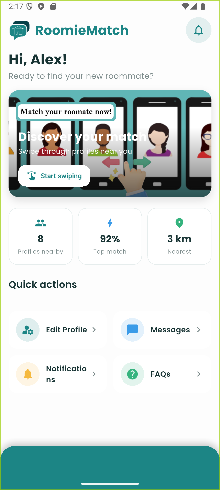

# RoomieMatch

A location-based roommate matching mobile app built with Flutter. Swipe through potential roommates, filter by your preferences, and chat with your matches — all in one place.

<div align="center">
  
  
  
  
</div>

## Features

- **Swipe-to-match** deck with smooth, Tinder-style drag gestures, like/nope stamps and match-score cards.
- **Smart filtering** by distance, gender, age and budget.
- **End-to-end encrypted chat** with matched roommates.
- **Push notifications** for new matches and messages (via NTFY).
- **Do Not Disturb / sleep mode** to pause matching.
- **Editable profile & preferences** with a map-based location picker.
- **SuperTokens authentication** with a fully offline demo mode.

## Tech stack

| Layer | Technology |
| --- | --- |
| Framework | Flutter (Dart) |
| State | Provider + Hive |
| Local storage | Hive, Sqflite, flutter_secure_storage |
| Auth | SuperTokens |
| Notifications | NTFY + flutter_local_notifications |
| Backend (separate repo) | FastAPI + MySQL |

## Getting started

> **Important:** this app pins `supertokens_flutter 0.6.2`, which requires **Dart `<3.9.0`** (Flutter **3.32.8**). Newer Flutter releases will fail `flutter pub get`.

```bash
# Install & use the compatible Flutter version (recommended via FVM)
fvm install 3.32.8
fvm use 3.32.8

# Or if Flutter 3.32.8 is already on your PATH
flutter pub get
flutter run
```

### Offline demo mode (no backend required)

The app runs standalone out of the box using in-memory mock data (sample profiles, matches and conversations), so you can explore the full experience without starting any backend services. Log in with **any** username and password.

- Offline mode (default): `flutter run`
- Real backend: `flutter run --dart-define=OFFLINE_MODE=false`

## Project structure

```
lib/
├── main.dart                # Entry point + theme
├── app_theme.dart           # Colour palette & Poppins typography
├── config.dart              # OFFLINE_MODE flag
├── chat_detail_page.dart    # Chat screen
├── filter_page.dart         # Match filters
├── info_page.dart           # Profile detail sheet
├── widgets/
│   └── app_bottom_nav.dart  # Shared bottom navigation
├── models/                  # Hive data models
├── services/                # API, auth, DB, messaging, mock backend
├── stores/                  # App state (Provider)
└── views/                   # Screens (login, home, swipe, chat, settings, registration)
```

---

_Originally developed as part of the Software Engineering Group Project module at the University of Nottingham Malaysia._
